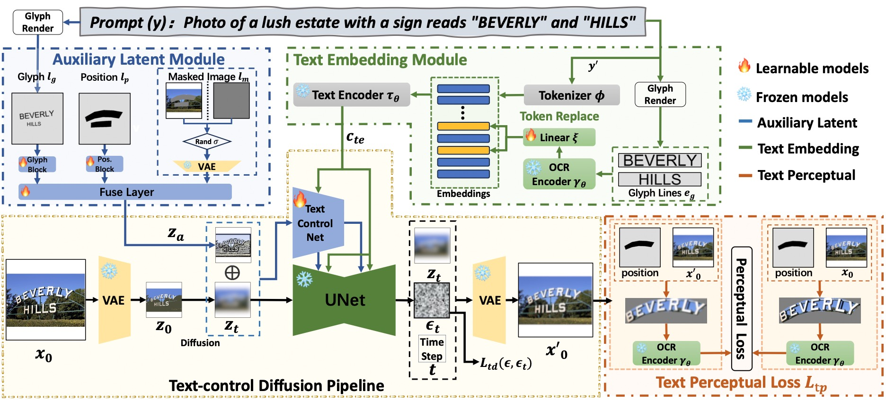
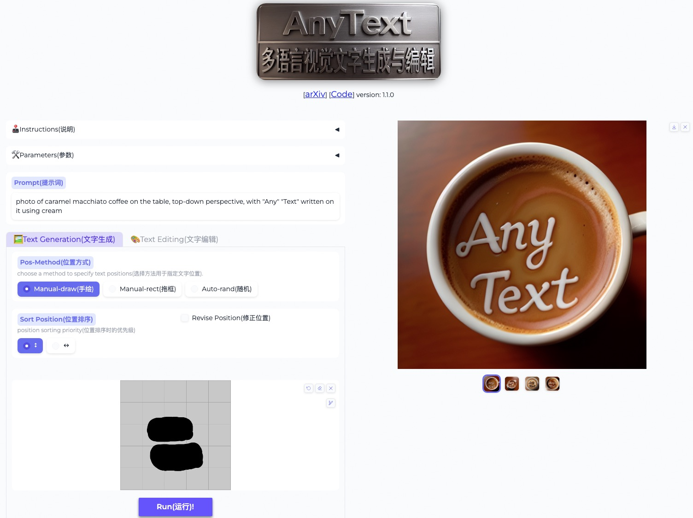
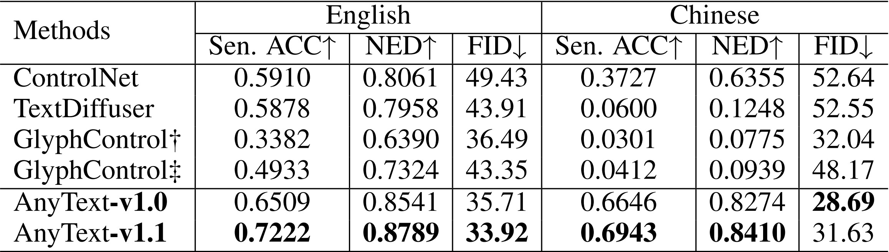
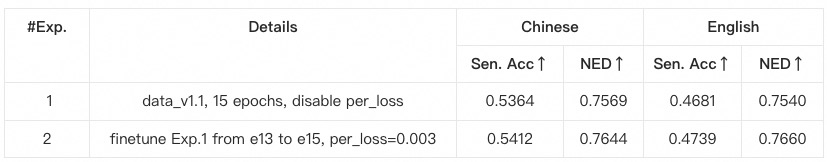

# AnyText: Multilingual Visual Text Generation And Editing

<a href='https://arxiv.org/abs/2311.03054'></a> <a href='https://github.com/tyxsspa/AnyText'></a> <a href='https://modelscope.cn/studios/damo/studio_anytext'></a> <a href='https://huggingface.co/spaces/modelscope/AnyText'></a> <a href='https://help.aliyun.com/zh/dashscope/developer-reference/tongyi-wanxiang-api-for-anytext'></a>


## 📌News
[2024.03.03] - 🔥🔥🔥We have open-sourced AnyText2, which is faster, performs better, and allows you to set properties such as font and color for the text! See [[demo]](https://modelscope.cn/studios/iic/studio_anytext2) [[code]](https://github.com/tyxsspa/AnyText2) [[ckpt]](https://modelscope.cn/models/iic/cv_anytext2)!  
[2024.04.18] - 👏👏👏The training code and dataset([**AnyWord-3M**](https://modelscope.cn/datasets/iic/AnyWord-3M/summary)) are released!  
[2024.04.18] - You can merge weights from self-trained or community models into AnyText now, including all base models and LoRA models based on SD1.5. Have fun!  
[2024.02.21] - The evaluation code and dataset(**AnyText-benchmark**) are released.  
[2024.02.06] - Happy Lunar New Year Everyone! We've launched a fun app(表情包大师/MeMeMaster) on [ModelScope](https://modelscope.cn/studios/iic/MemeMaster/summary) and [HuggingFace](https://huggingface.co/spaces/martinxm/MemeMaster) to create cute meme stickers. Come and have fun with it!   
[2024.01.17] - 🎉AnyText has been accepted by ICLR 2024(**Spotlight**)!  
[2024.01.04] - FP16 inference is available, 3x faster! Now the demo can be deployed on GPU with >8GB memory. Enjoy!  
[2024.01.04] - HuggingFace Online demo is available [here](https://huggingface.co/spaces/modelscope/AnyText)!  
[2023.12.28] - ModelScope Online demo is available [here](https://modelscope.cn/studios/damo/studio_anytext/summary)!  
[2023.12.27] - 🧨We released the latest checkpoint(v1.1) and inference code, check on [ModelScope](https://modelscope.cn/models/damo/cv_anytext_text_generation_editing/summary) in Chinese.  
[2023.12.05] - The paper is available at [here](https://arxiv.org/abs/2311.03054).  

For more AIGC related works of our group, please visit [here](https://github.com/AIGCDesignGroup), and we are seeking collaborators and research interns([Email us](mailto:cangyu.gyf@alibaba-inc.com)).

## ⏰TODOs
- [x] Release the model and inference code
- [x] Provide publicly accessible demo link
- [ ] Provide a free font file(🤔)
- [x] Release tools for merging weights from community models or LoRAs
- [ ] Support AnyText in stable-diffusion-webui(🤔)
- [x] Release AnyText-benchmark dataset and evaluation code
- [x] Release AnyWord-3M dataset and training code
 

## 💡Methodology
AnyText comprises a diffusion pipeline with two primary elements: an auxiliary latent module and a text embedding module. The former uses inputs like text glyph, position, and masked image to generate latent features for text generation or editing. The latter employs an OCR model for encoding stroke data as embeddings, which blend with image caption embeddings from the tokenizer to generate texts that seamlessly integrate with the background. We employed text-control diffusion loss and text perceptual loss for training to further enhance writing accuracy.



## 🛠Installation
```bash
# Install git (skip if already done)
conda install -c anaconda git
# Clone anytext code
git clone https://github.com/tyxsspa/AnyText.git
cd AnyText
# Prepare a font file; Arial Unicode MS is recommended, **you need to download it on your own**
mv your/path/to/arialuni.ttf ./font/Arial_Unicode.ttf
# Create a new environment and install packages as follows:
conda env create -f environment.yaml
conda activate anytext
```

## 🔮Inference
**[Recommend]**： We release a demo on [ModelScope](https://modelscope.cn/studios/damo/studio_anytext/summary) and [HuggingFace](https://huggingface.co/spaces/modelscope/AnyText)! You can also try AnyText through our [API](https://help.aliyun.com/zh/dashscope/developer-reference/tongyi-wanxiang-api-for-anytext?spm=a2c4g.11186623.0.0.31f5e0f6B8s4rF) service.

AnyText include two modes: Text Generation and Text Editing. Running the simple code below to perform inference in both modes and verify whether the environment is correctly installed.
```bash
python inference.py
```
If you have advanced GPU (with at least 8G memory), it is recommended to deploy our demo as below, which includes usage instruction, user interface and abundant examples.
```bash
export CUDA_VISIBLE_DEVICES=0 && python demo.py
```
FP16 inference is used as default, and a Chinese-to-English translation model is loaded for direct input of Chinese prompt (occupying ~4GB of GPU memory). The default behavior can be modified, as the following command enables FP32 inference and disables the translation model:
```bash
export CUDA_VISIBLE_DEVICES=0 && python demo.py --use_fp32 --no_translator
```
If FP16 is used and the translation model not used(or load it on CPU, [see here](https://github.com/tyxsspa/AnyText/issues/33)), generation of one single 512x512 image will occupy ~7.5GB of GPU memory.  
In addition, other font file can be used by(although the result may not be optimal):
```bash
export CUDA_VISIBLE_DEVICES=0 && python demo.py --font_path your/path/to/font/file.ttf
```
You can also load a specified AnyText checkpoint:
```bash
export CUDA_VISIBLE_DEVICES=0 && python demo.py --model_path your/path/to/your/own/anytext.ckpt
```

**Please note** that when executing inference for the first time, the model files will be downloaded to: `~/.cache/modelscope/hub`. If you need to modify the download directory, you can manually specify the environment variable: `MODELSCOPE_CACHE`.

In this demo, you can change the style during inference by either change the base model or loading LoRA models(must based on SD1.5):  
- Change base model: Simply fill in your local base model's path in the [Base Model Path].  
- Load LoRA models: Input your LoRA model's path and weight ratio into the [LoRA Path and Ratio]. For example: `/path/of/lora1.pth 0.3 /path/of/lora2.safetensors 0.6`.

## 📈Evaluation
### 1. Data Preparation

Download the AnyText-benchmark dataset from [ModelScope](https://modelscope.cn/datasets/iic/AnyText-benchmark/summary) or [GoogleDrive](https://drive.google.com/drive/folders/1Eesj6HTqT1kCi6QLyL5j0mL_ELYRp3GV) and unzip the files. In *benchmark* folder, *laion_word* and *wukong_word* are datasets for English and Chinese evaluation, respectively. Open each *test1k.json* and modify the `data_root` with your own path of *imgs* folder. The *FID* directory contains images that are used for calculating the FID (Fréchet Inception Distance) score.

### 2. Generate Images

Before evaluation, we need to generate corresponding images for each method based on the evaluation set. We have also provided [pre-generated images](https://drive.google.com/file/d/1pGN35myilYY04ChFtgAosYr0oqeBy4NU/view?usp=drive_link) for all methods.  Follow the instructions below to generate images on you own. Note that you need modify the paths and other parameters in the bash script accordingly.
- AnyText
```bash
bash ./eval/gen_imgs_anytext.sh
```
（If you encounter an error caused by huggingface being blocked, please uncomment line 98 of ./models_yaml/anytext_sd15.yaml, and replace the path of the *clip-vit-large-patch14* folder with a local one）  
- ControlNet, Textdiffuser, GlyphControl  
We use glyph images rendered from AnyText-benchmark dataset as conditional input for these methods:
```bash
bash eval/gen_glyph.sh
```
Next, please clone the official repositories of **ControlNet**, **Textdiffuser**, and **GlyphControl**, and follow their documentation to set up the environment, download the respective checkpoints, and ensure that inference can be executed normally. Then, copy the three files `<method>_singleGPU.py`, `<method>_multiGPUs.py`, and `gen_imgs_<method>.sh` from the *./eval* folder to the root directory of the corresponding codebases, and run:
```bash
bash gen_imgs_<method>.sh
```

### 3. Evaluate

We use Sentence Accuracy (Sen. ACC) and Normalized Edit Distance (NED) to evaluate the accuracy of generated text. Please run:
```bash
bash eval/eval_ocr.sh
```
We use the FID metric to assess the quality of generated images. Please run:
```bash
bash eval/eval_fid.sh
```

Compared to existing methods, AnyText has a significant advantage in both English and Chinese text generation.  

Please note that we have reorganized the code and have further aligned the configuration for each method under evaluation. As a result, there may be minor numerical differences compared to those reported in the original paper.

## 🚂Training
1. It is highly recommended to create and activate the `anytext` virtual environment from previous instructions, where the versions of libraries are verified. Otherwise, if you encounter an environmental dependency or training issue, please check if it matches with the versions as listed in `environment.yaml`.  
2. Download training dataset [**AnyWord-3M**](https://modelscope.cn/datasets/iic/AnyWord-3M/summary) from ModelScope, unzip all \*.zip files in each subfolder, then open *\*.json* and modify the `data_root` with your own path of *imgs* folder for each sub dataset.  
3. Download SD1.5 checkpoint from [HuggingFace](https://huggingface.co/runwayml/stable-diffusion-v1-5/tree/main), then run `python tool_add_anytext.py` to get an anytext pretrained model.  
4. Run `python train.py`.  
**Note**: Training AnyText on 8xA100 (80GB) takes ~312 hours, you can also quickly reproduce it with 200k images, which takes ~60 hours on 8xV100(32GB). Enable Perceptual Loss will consume a significant amount of VRAM and reduce the training speed. Additionally, filtering out images containing watermarks will lower the likelihood of generating watermarks. These two steps are usually activated in the last 1 or 2 epochs. Relevant parameters can be found in the `Configs` within train.py, please check carefully.  
The metrics we achieved using 200k images for reproduce are as follows. Note that these metrics are significantly higher than those reported in the original paper because we used V1.1 data and code. For more details, see Appendix 7 of the original paper.  


## 🌄Gallery


## Citation
```
@article{tuo2023anytext,
      title={AnyText: Multilingual Visual Text Generation And Editing}, 
      author={Yuxiang Tuo and Wangmeng Xiang and Jun-Yan He and Yifeng Geng and Xuansong Xie},
      year={2023},
      eprint={2311.03054},
      archivePrefix={arXiv},
      primaryClass={cs.CV}
}
```

